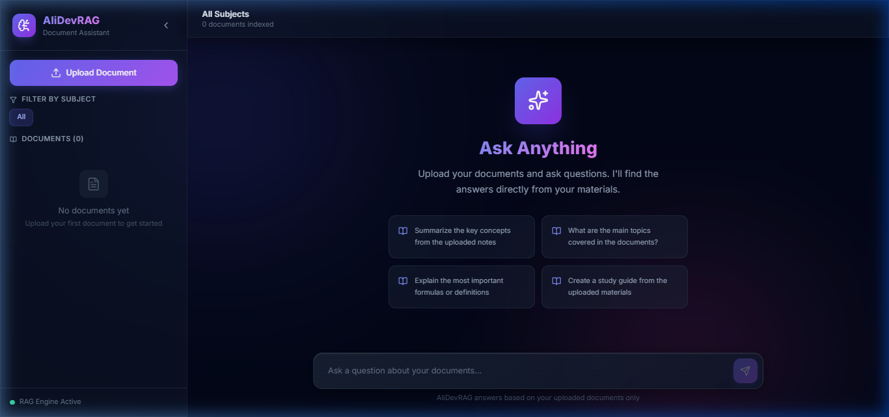

# AliDevRAG 🤖📄

A **Retrieval-Augmented Generation (RAG)** system that lets you upload documents and ask AI-powered questions — getting accurate, source-cited answers based strictly on your uploaded content.

Built with **FastAPI** (backend) + **React + Vite** (frontend) + **Google Gemini AI**.

---

## 🖼️ Preview



---

## 🗂️ Project Structure

```
RAG system for school/
├── backend/               # FastAPI Python backend
│   ├── main.py            # API routes & server entry point
│   ├── rag_engine.py      # Vector store + Gemini RAG logic
│   ├── document_processor.py  # PDF/DOCX/TXT text extraction
│   ├── requirements.txt   # Python dependencies
│   ├── .env               # Environment variables (API key)
│   ├── uploads/           # Uploaded document files
│   └── simple_chroma_db.json  # Persisted vector store
│
└── frontend/              # React + Vite frontend
    ├── src/               # React source files
    ├── index.html
    ├── vite.config.js
    └── package.json
```

---

## ⚙️ Tech Stack

| Layer      | Technology                          |
|------------|-------------------------------------|
| Frontend   | React, Vite, Tailwind CSS           |
| Backend    | FastAPI, Uvicorn                    |
| AI Model   | Google Gemini (`gemini-flash-latest`) |
| Embeddings | Google Gemini Embedding (`gemini-embedding-001`) |
| Vector DB  | Custom JSON-based vector store (NumPy cosine similarity) |
| File Types | PDF, DOCX, TXT                      |

---

## 🚀 Getting Started

### Prerequisites

- **Python** 3.10+
- **Node.js** 18+
- A **Google Gemini API key** → [Get one here](https://aistudio.google.com/app/apikey)

---

### 1. Backend Setup

```powershell
cd backend
```

Install dependencies:

```powershell
pip install -r requirements.txt
```

Create a `.env` file in the `backend/` folder:

```env
GEMINI_API_KEY=your_gemini_api_key_here
```

Start the backend server:

```powershell
uvicorn main:app --host 0.0.0.0 --port 8000 --reload
```

Backend will be live at → **http://localhost:8000**

---

### 2. Frontend Setup

```powershell
cd frontend
```

Install dependencies:

```powershell
npm install
```

Start the frontend dev server:

```powershell
npm run dev
```

Frontend will be live at → **http://localhost:3000**

---

## 📡 API Endpoints

| Method   | Endpoint                    | Description                        |
|----------|-----------------------------|------------------------------------|
| `GET`    | `/`                         | Health check                       |
| `POST`   | `/api/upload`               | Upload a document (PDF/DOCX/TXT)   |
| `POST`   | `/api/ask`                  | Ask a question against documents   |
| `GET`    | `/api/documents`            | List all uploaded documents        |
| `DELETE` | `/api/documents/{doc_id}`   | Delete a document                  |
| `GET`    | `/api/subjects`             | List all unique subjects           |

### Example — Ask a Question

```json
POST /api/ask
{
  "question": "What are the main topics covered?",
  "subject": "Math"   // optional — omit to search all docs
}
```

**Response:**
```json
{
  "answer": "Based on the uploaded documents...",
  "sources": [
    { "filename": "math_notes.pdf", "subject": "Math" }
  ]
}
```

---

## 🔑 Environment Variables

| Variable         | Required | Description                  |
|------------------|----------|------------------------------|
| `GEMINI_API_KEY` | ✅ Yes   | Your Google Gemini API key   |

Place this in `backend/.env`.

---

## 📄 Supported File Types

| Format | Extension |
|--------|-----------|
| PDF    | `.pdf`    |
| Word   | `.docx`   |
| Text   | `.txt`    |

---

## 🛠️ How It Works

1. **Upload** — A document is uploaded, text is extracted and split into chunks
2. **Embed** — Each chunk is embedded using Gemini's embedding model
3. **Store** — Embeddings are saved to a local JSON-based vector store
4. **Query** — User's question is embedded and compared via cosine similarity
5. **Generate** — Top matching chunks are passed to Gemini as context to generate an answer with sources

---

## 📦 Backend Dependencies

```
fastapi==0.115.0
uvicorn[standard]==0.30.0
python-multipart==0.0.9
google-genai>=1.0.0
PyPDF2==3.0.1
python-docx==1.1.0
langchain-text-splitters==0.2.0
pydantic>=2.8.0
numpy<2
python-dotenv>=1.0.0
```

---

## 🤝 Contributing

Pull requests are welcome. For major changes, please open an issue first to discuss what you'd like to change.

---

## 📜 License

MIT
